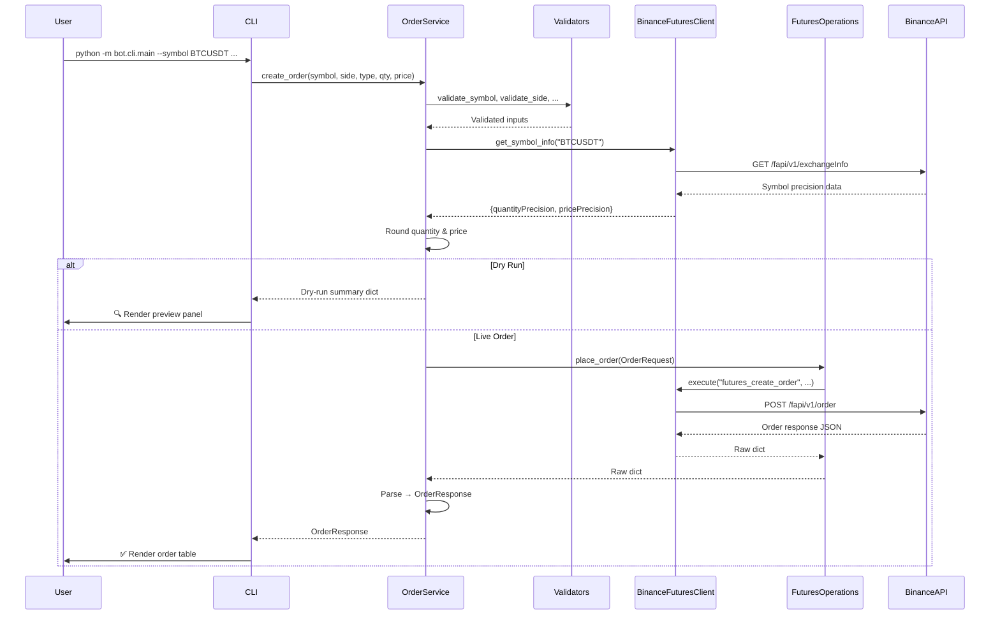
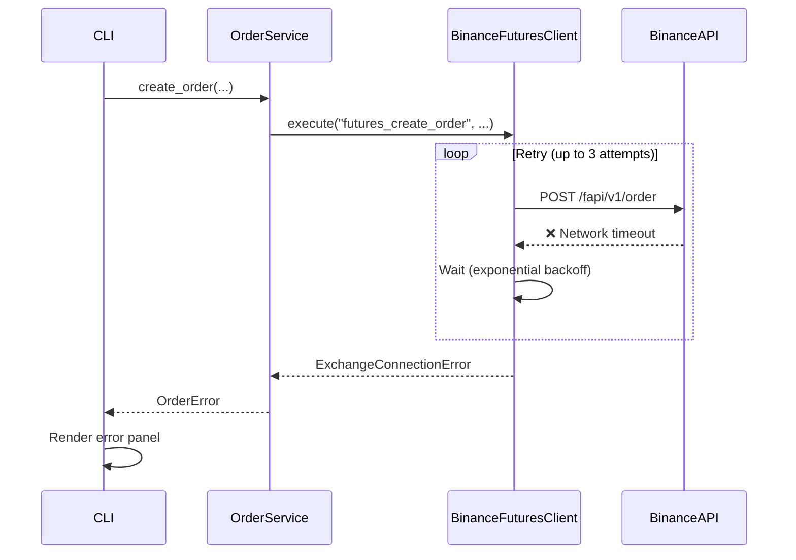

# 🚀 Binance Futures Testnet Trading Bot

A **production-quality**, CLI-based trading bot for placing orders on the [Binance Futures Testnet](https://testnet.binancefuture.com). Built with clean architecture, strong typing, structured logging, and a professional developer experience.

---

## ✨ Features

| Feature | Description |
|---|---|
| **Order Types** | MARKET and LIMIT orders (BUY / SELL) |
| **Precision Handling** | Automatic quantity & price rounding from exchange info |
| **Dry-Run Mode** | Validate orders without submitting (`--dry-run`) |
| **Structured Logging** | JSON file logs + human-readable console output |
| **Retry Logic** | Exponential backoff for transient network failures |
| **Rich CLI** | Colored tables, panels, and formatted output via Rich |
| **Validation** | Comprehensive input validation with descriptive errors |
| **Docker Support** | Ready-to-run container image |
| **Unit Tests** | pytest suite covering validators, services, and models |

---

## 🏗 Architecture

The project follows a **clean, layered architecture** that separates concerns and keeps each module focused:

```
CLI Layer ──▶ Service Layer ──▶ Exchange Layer ──▶ Binance SDK
   │               │                  │
   │          Validators          Client Wrapper
   │          Precision           Retry Logic
   │                              Error Translation
   ▼
Rich Output
```

### Sequence Diagram — Order Placement



### Sequence Diagram — Error Handling & Retry



### Project Structure

```
trading_bot/
│
├── bot/
│   ├── __init__.py              # Package metadata
│   ├── config/
│   │   └── settings.py          # Pydantic BaseSettings (.env loading)
│   ├── core/
│   │   ├── enums.py             # OrderSide, OrderType, TimeInForce
│   │   ├── exceptions.py        # Domain exception hierarchy
│   │   └── logger.py            # Structured logging setup
│   ├── exchange/
│   │   ├── binance_client.py    # SDK wrapper with retry & logging
│   │   └── futures.py           # High-level order operations
│   ├── models/
│   │   ├── order_request.py     # Pydantic order input model
│   │   └── order_response.py    # Pydantic order output model
│   ├── services/
│   │   └── order_service.py     # Business logic orchestrator
│   ├── utils/
│   │   ├── validators.py        # Input validation functions
│   │   └── helpers.py           # Precision & formatting helpers
│   └── cli/
│       └── main.py              # Typer + Rich CLI entry point
│
├── tests/
│   ├── test_validators.py       # Validator unit tests
│   └── test_order_service.py    # Service layer unit tests
│
├── logs/                        # Rotating log files (auto-created)
├── .env.example                 # Environment template
├── .gitignore
├── Dockerfile
├── Makefile
├── README.md
├── requirements.txt
└── pyproject.toml
```

---

## 📋 Prerequisites

- **Python 3.11+**
- **Binance Futures Testnet account** with API keys

---

## 🔧 Installation

### 1. Clone the repository

```bash
git clone <repository-url>
cd trading_bot
```

### 2. Create a virtual environment

```bash
python3 -m venv .venv
source .venv/bin/activate
```

### 3. Install dependencies

```bash
make install
# or
pip install -r requirements.txt
```

### 4. Configure environment

```bash
cp .env.example .env
# Edit .env with your Binance Futures Testnet API keys
```

---

## 🔑 Binance Testnet Setup

1. Go to [https://testnet.binancefuture.com](https://testnet.binancefuture.com)
2. Log in with your GitHub account
3. Navigate to **API Key** section
4. Generate a new API Key and Secret
5. Copy both values into your `.env` file:

```env
BINANCE_API_KEY=your_testnet_api_key
BINANCE_API_SECRET=your_testnet_api_secret
BASE_URL=https://testnet.binancefuture.com
```

> **⚠️ Important:** These are **testnet** keys — they do not access real funds. Never commit your `.env` file.

---

## 🚀 Usage

### Market Buy

```bash
python -m bot.cli.main --symbol BTCUSDT --side BUY --type MARKET --quantity 0.001
```

### Market Sell

```bash
python -m bot.cli.main --symbol ETHUSDT --side SELL --type MARKET --quantity 0.01
```

### Limit Buy

```bash
python -m bot.cli.main --symbol BTCUSDT --side BUY --type LIMIT --quantity 0.001 --price 95000
```

### Limit Sell

```bash
python -m bot.cli.main --symbol BTCUSDT --side SELL --type LIMIT --quantity 0.001 --price 100000
```

### Dry Run (validate without submitting)

```bash
python -m bot.cli.main --symbol BTCUSDT --side BUY --type MARKET --quantity 0.001 --dry-run
```

### Using Make

```bash
make run ARGS="--symbol BTCUSDT --side BUY --type MARKET --quantity 0.001"
make run ARGS="--symbol BTCUSDT --side BUY --type LIMIT --quantity 0.001 --price 95000 --dry-run"
```

### CLI Help

```bash
python -m bot.cli.main --help
```

---

## 🧪 Testing

```bash
# Run all tests
make test

# Run with coverage
make test-cov

# Run directly
python -m pytest tests/ -v
```

### Test Coverage

| Module | Coverage |
|---|---|
| `bot.utils.validators` | Comprehensive (symbol, side, type, quantity, price) |
| `bot.services.order_service` | Validation, precision, dry-run, response parsing |
| `bot.models.order_response` | Deserialization from exchange JSON |

---

## 🐳 Docker

### Build

```bash
make docker
# or
docker build -t trading-bot:latest .
```

### Run

```bash
# Show help
docker run --rm trading-bot:latest

# Place an order
docker run --rm --env-file .env trading-bot:latest \
    --symbol BTCUSDT --side BUY --type MARKET --quantity 0.001

# Dry run
docker run --rm --env-file .env trading-bot:latest \
    --symbol BTCUSDT --side BUY --type MARKET --quantity 0.001 --dry-run
```

---

## 📊 Logging

The bot produces structured logs in two channels:

| Channel | Format | Location |
|---|---|---|
| **Console** | Human-readable with timestamps | `stdout` |
| **File** | JSON-structured, rotating | `logs/trading_bot.log` |

### Log contents

- ✅ API requests (method, params)
- ✅ API responses (full payload)
- ✅ Latency (milliseconds)
- ✅ Validation errors
- ✅ Exception stack traces
- ✅ Retry attempts

### Rotation policy

- **Max file size:** 5 MB
- **Backup count:** 5 files
- **Encoding:** UTF-8

---

## 🔁 Retry Logic

Transient failures (network timeouts, connection drops) are retried using **Tenacity**:

- **Strategy:** Exponential backoff
- **Max attempts:** 3 (configurable via `RETRY_MAX_ATTEMPTS`)
- **Base wait:** 1 second (configurable via `RETRY_BASE_WAIT`)
- **Retried exceptions:** `ExchangeConnectionError` (wraps `BinanceRequestException`)
- **Non-retried:** Validation errors, authentication errors, API-level rejections

---

## 📐 Precision Handling

Before placing an order, the bot:

1. Fetches exchange info for the symbol (`GET /fapi/v1/exchangeInfo`)
2. Extracts `quantityPrecision` and `pricePrecision`
3. Truncates (rounds down) quantity and price to the allowed precision

This prevents order rejections due to over-precise values (e.g., sending `0.00156` when max precision is 3 → truncated to `0.001`).

---

## ⚙️ Configuration

All configuration is loaded from environment variables (or `.env`):

| Variable | Required | Default | Description |
|---|---|---|---|
| `BINANCE_API_KEY` | ✅ | — | Testnet API key |
| `BINANCE_API_SECRET` | ✅ | — | Testnet API secret |
| `BASE_URL` | — | `https://testnet.binancefuture.com` | API endpoint |
| `DEFAULT_RECV_WINDOW` | — | `5000` | Request validity window (ms) |
| `RETRY_MAX_ATTEMPTS` | — | `3` | Max retry attempts |
| `RETRY_BASE_WAIT` | — | `1.0` | Base backoff wait (seconds) |
| `LOG_LEVEL` | — | `INFO` | Logging level |

---

## 📝 Assumptions

1. **Testnet only** — This bot is designed for the Binance Futures Testnet. Do not use with real credentials or mainnet endpoints.
2. **USDT-M Futures** — Only USDT-margined futures contracts are supported.
3. **Single order** — Each CLI invocation places one order. No batch or strategy modes.
4. **GTC default** — Limit orders default to Good-Till-Cancel time-in-force.
5. **Python 3.11+** — Uses modern syntax (`X | Y` unions, `match` compatibility).

---

## 🔮 Future Improvements

- [ ] **WebSocket streaming** for real-time price feeds and order updates
- [ ] **Stop-Loss / Take-Profit** order support
- [ ] **Position management** — view and close open positions
- [ ] **Strategy engine** — pluggable trading strategies
- [ ] **Database persistence** — store order history in SQLite/PostgreSQL
- [ ] **Prometheus metrics** — latency, order counts, error rates
- [ ] **CI/CD pipeline** — GitHub Actions for linting, testing, and Docker builds
- [ ] **Multi-exchange support** — abstract exchange interface for Bybit, OKX, etc.
- [ ] **Rate limiting** — respect exchange rate limits with token-bucket
- [ ] **Interactive mode** — REPL-style order entry with prompts

---

## 📄 License

MIT License — see [LICENSE](LICENSE) for details.
# Finance-Bot
